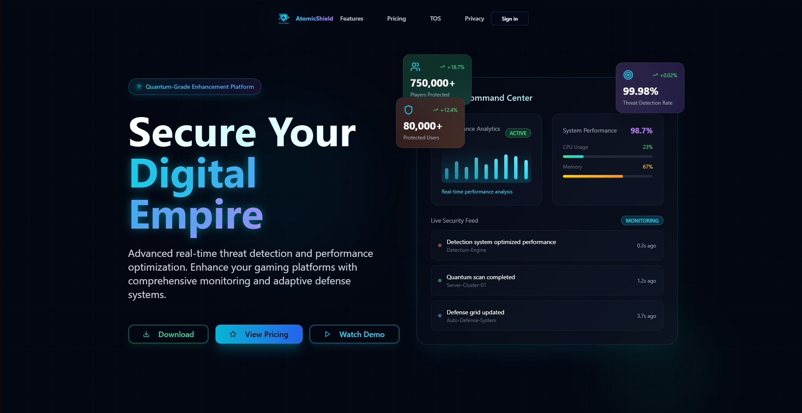
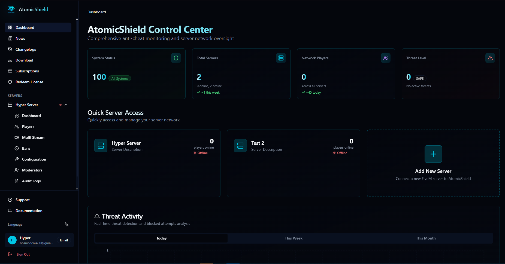

# AtomicShield — Advanced FiveM Anti-Cheat Dashboard

[](https://www.typescriptlang.org/)
[](https://reactjs.org/)
[](https://vitejs.dev/)
[](https://expressjs.com/)
[](https://tailwindcss.com/)
[](LICENSE)

<p align="center">
  
  <br>
  <em>Home Page</em>
</p>

<p align="center">
  
  <br>
  <em>Dashboard</em>
</p>

**AtomicShield** is a cutting-edge anti-cheat protection system for FiveM servers, featuring a modern web-based management dashboard. This repository contains the full-stack web application — a React SPA frontend with an Express API backend — for managing anti-cheat configurations, monitoring player activity, managing bans, and analyzing server security in real time.

> **FiveM anti-cheat** with kernel-aided memory scanning, manual-map DLL detection, obfuscated loaders, fingerprinting, exploit traps, and a shared ban network.

---

## Key Features

- **Real-Time Monitoring Dashboard** — Live player activity, threat detection, and server performance metrics with interactive charts
- **Ban Management** — Full CRUD operations with search, filter, pagination, evidence tracking, and false-positive reporting
- **Player Management** — View online players, kick/ban actions, player details, screenshot capture, and activity stats
- **Anti-Cheat Configuration** — Dynamic configuration system with 5 categories (General, Detection, Punishment, Hits & Exceptions, Logging & Notifications) and 30+ configurable settings
- **Authentication System** — JWT-based auth with email/password, Discord OAuth, and Google OAuth support
- **Moderator Management** — Invite, manage permissions, and track moderator activity
- **Audit Logs** — Comprehensive logging with severity levels, categories, and search
- **Subscription Management** — Multi-tier pricing (Basic $40/mo, Pro $80/3mo, Enterprise $250/lifetime) with Polar.sh payment processing
- **Multi-Language Support** — 10 languages: English, Spanish, French, German, Dutch, Italian, Portuguese, Korean, Czech, Vietnamese
- **SEO Optimized** — Structured data (JSON-LD), Open Graph, Twitter Cards, per-route meta tags, sitemap
- **Responsive Design** — Mobile-first sidebar dashboard with dark theme
- **Webhook Integration** — Discord webhook notifications for bans, kicks, detections, and system events

## Tech Stack

| Layer           | Technology                                                                 |
| --------------- | -------------------------------------------------------------------------- |
| **Frontend**    | React 18, TypeScript, Vite 5, TailwindCSS 3, React Router 6 (SPA mode)     |
| **Backend**     | Express 4, TypeScript, JWT (jsonwebtoken), express-session, Zod validation |
| **State**       | TanStack Query (React Query), React Context                                |
| **UI Library**  | shadcn/ui (Radix UI primitives + Tailwind), Lucide React icons             |
| **Charts**      | Recharts                                                                   |
| **Animations**  | Framer Motion                                                              |
| **3D Graphics** | Three.js (react-three-fiber, @react-three/drei)                            |
| **Testing**     | Vitest                                                                     |
| **Build**       | Vite (client), Vite (server bundle), pkg (binary)                          |
| **Payment**     | Polar.sh                                                                   |

## Quick Start

```bash
# Install dependencies
npm install

# Start development server (client + backend on port 8080)
npm run dev

# Run tests
npm test

# TypeScript validation
npm run typecheck

# Production build
npm run build

# Start production server
npm start
```

## Project Structure

```
├── client/                   # React SPA frontend
│   ├── pages/               # 13 route components
│   ├── components/           # 58 components + ui/ library
│   │   └── ui/              # shadcn/ui components (51 files)
│   ├── lib/                  # 15 utility modules
│   ├── hooks/                # 9 React hooks
│   ├── contexts/             # Auth context provider
│   ├── App.tsx               # Root with routing
│   └── global.css            # Tailwind dark theme
├── server/                   # Express API backend
│   ├── routes/              # 10 route handlers
│   ├── middleware/           # JWT auth middleware
│   ├── index.ts             # Server setup + route registration
│   └── standalone.ts        # Standalone entry point
├── shared/                   # Shared types
│   ├── api.ts               # All API types + endpoint constants
│   └── configuration.ts     # Configuration type definitions
├── public/                   # Static assets
├── docs/                     # Documentation (see below)
├── screenshots/              # Screenshots
└── config files              # package.json, tsconfig, vite config, tailwind.config, etc.
```

## API Endpoints

The Express API provides the following endpoint groups, all prefixed with `/api`:

- **Auth** — `POST /api/auth/signin`, `POST /api/auth/signup`, `GET /api/auth/social/:provider`, `POST /api/auth/forgot-password`, `POST /api/auth/reset-password`, `GET /api/auth/profile`
- **OAuth** — Google (`/api/auth/google/*`) and Discord (`/api/auth/discord/*`) OAuth flows
- **Dashboard** — `GET /api/dashboard/` (protected)
- **Players** — `GET /api/players`, `POST /api/players/kick`, `POST /api/players/ban`, `POST /api/players/screenshot/:playerId`, `GET /api/players/stats`
- **Bans** — `GET /api/bans`, `POST /api/bans/create`, `PUT /api/bans/update/:banId`, `DELETE /api/bans/delete/:banId`
- **Servers** — `GET /api/servers`, `POST /api/servers/add`, `DELETE /api/servers/:serverId`, `GET /api/server/:serverId/*`
- **Configuration** — `GET /api/server/:serverId/configuration`, `PUT /api/server/:serverId/configuration`
- **Webhooks** — `POST /api/webhook/test`

> Full API reference: [docs/API.md](docs/API.md) | Route map: [docs/ROUTES.md](docs/ROUTES.md)

## Documentation

| Document                                 | Description                                |
| ---------------------------------------- | ------------------------------------------ |
| [Architecture](docs/ARCHITECTURE.md)     | Overall system architecture and data flow  |
| [API Reference](docs/API.md)             | Complete API endpoint documentation        |
| [Frontend](docs/FRONTEND.md)             | Frontend architecture, components, routing |
| [Backend](docs/BACKEND.md)               | Backend architecture, middleware, routes   |
| [Deployment](docs/DEPLOYMENT.md)         | Build, deploy, environment variables       |
| [SEO](docs/SEO.md)                       | SEO strategy, structured data, meta tags   |
| [Configuration](docs/CONFIGURATION.md)   | Anti-cheat configuration system            |
| [Authentication](docs/AUTHENTICATION.md) | Auth flows (email, Discord, Google)        |
| [Routes](docs/ROUTES.md)                 | Complete frontend and backend route map    |
| [Components](docs/COMPONENTS.md)         | UI component library reference             |

## Configuration System

The anti-cheat configuration is organized into 5 categories with a registry-based architecture:

1. **General Settings** — Shield enable/disable, protection level, server name, max players, scan frequency
2. **Detection Settings** — Aimbot, wallhack, speed hack detection, sensitivity, behavioral analysis
3. **Punishment Settings** — Auto-ban, ban duration, kick/warning system, escalation policy, global ban network
4. **Hits & Exceptions** — Admin/moderator/VIP immunity, whitelist mode, hit threshold, decay, false-positive learning
5. **Logging & Notifications** — Discord webhooks, log levels, retention, auto-backup, export

## Authentication

- JWT-based with 24-hour token expiry
- Three providers: email/password, Discord OAuth, Google OAuth
- Zod validation on all auth endpoints
- Protected routes with `ProtectedRoute` wrapper component
- Auto-redirect to sign-in on 401 responses
- Multi-tab auth state sync via `StorageEvent` listeners

## Languages

| Code | Language   | Code | Language   |
| ---- | ---------- | ---- | ---------- |
| en   | English    | it   | Italiano   |
| es   | Español    | pt   | Português  |
| fr   | Français   | ko   | 한국어     |
| de   | Deutsch    | cs   | Čeština    |
| nl   | Nederlands | vi   | Tiếng Việt |

## Deployment

**Standard:**

```bash
npm run build    # Builds both client (dist/spa) and server (dist/server)
npm start        # Starts production Express server
```

**Docker:** Dockerfile included in repository root.

**Binary:** Self-contained executables via `pkg` — supports Linux, macOS, and Windows.

**Netlify:** `netlify.toml` included for SPA deployment.

> Full deployment guide: [docs/DEPLOYMENT.md](docs/DEPLOYMENT.md)

## Environment Variables

| Variable         | Description             | Default                                    |
| ---------------- | ----------------------- | ------------------------------------------ |
| `JWT_SECRET`     | JWT signing secret      | `fallback-secret-change-in-production`     |
| `SESSION_SECRET` | Express session secret  | `fallback-secret-key-change-in-production` |
| `VITE_API_URL`   | API base URL for client | `/api`                                     |
| `PORT`           | Server port             | `8080`                                     |
| `NODE_ENV`       | Environment mode        | `development`                              |

## Development

```bash
# Frontend only (Vite dev server)
npm run dev:frontend

# Backend only (tsx watch mode)
npm run dev:backend

# Code formatting
npm run format.fix
```

## SEO & Performance

- **Structured Data**: Organization, Website, Product/SoftwareApplication, FAQ, HowTo, Article, Breadcrumb, LocalBusiness schemas
- **Meta Tags**: Per-route title, description, keywords, Open Graph, Twitter Cards via `react-helmet-async`
- **Robots**: `robots.txt` with sitemap reference
- **Icons**: Full favicon set, Apple touch icon, Android Chrome icons
- **Lazy Loading**: Route-based code splitting via React Router

## License

Proprietary. All rights reserved. See [LICENSE](LICENSE) file for details.

---

## 📬 Contact

- **Email:** hosniadem400@gmail.com & aifaouiameen@gmail.com

## Related Repositories

- [AtomicShield Server](https://github.com/adem-hosni/AtomicShieldServer) — Backend API and WebSocket server
- [AtomicShield Client](https://github.com/adem-hosni/AtomicShieldClient) — Anti-Cheat Client